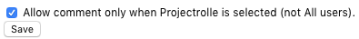

# jira check role chrome plugin  

When plugin is activ, than you must check a role in comment:  

  

You can set in settings that you must check a project role (not "All user"). That can you need if you dont contact with customers.  

